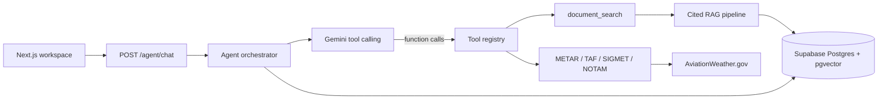

# Aviation Intelligence Platform

An agent-first aviation intelligence app: upload PDFs, ask questions in natural language, and get **cited document answers** or **live operational data** (METAR, TAF, SIGMETs, NOTAMs) from a single chat interface.

Built as a full-stack portfolio project to demonstrate RAG pipelines, LLM tool orchestration, typed APIs, and a polished product UI—not a generic chatbot wrapper.

---

## Highlights

| Area | What this project shows |
|------|-------------------------|
| **Agent orchestration** | Gemini tool-calling loop with a typed tool registry, bounded rounds, and unified response shape |
| **Grounded RAG** | PDF ingest → page-aware chunking → embeddings → pgvector search → citation-validated answers |
| **Trust boundaries** | Document citations only from `document_search`; live weather/NOTAMs only from operational tools |
| **Live aviation data** | Server-side METAR / TAF / international SIGMETs (AviationWeather.gov) plus demo NOTAMs |
| **Conversation memory** | Persistent chat sessions with recent-turn context for follow-ups |
| **Product UX** | Document library, scoped chat, tool activity, citations, and operational provenance in one workspace |
| **Engineering practices** | FastAPI + Next.js monorepo, Pydantic schemas, parameterized SQL, pytest coverage, env-based config |

---

## Features

- **Single agent chat** — the model answers directly or selects tools; the UI shows tool activity
- **Cited document Q&A** — answers grounded in uploaded aviation PDFs with source excerpts and insufficient-evidence handling
- **Document scoping** — attach a document so retrieval stays focused on that file
- **Document library** — upload PDFs, process (extract / chunk / embed), preview, and manage the collection
- **Operational tools** — airport weather, forecasts, SIGMETs, and demo NOTAMs with timestamps and source URLs
- **Session sidebar** — create, reopen, continue, and delete chats
- **Markdown answers** — formatted assistant responses with safe link handling
- **Legacy RAG APIs** — `POST /rag/query` and `POST /rag/search` kept for compatibility and testing
- **Health checks** — backend and database connectivity surfaced in the UI

---

## Example questions

```text
What contributing factors are discussed in this NTSB report?
What FAA guidance applies to runway incursion prevention?
What's the current METAR for KJFK?
Give me the TAF for KLAX and any active NOTAMs.
Are there international SIGMETs for turbulence?
```

---

## Architecture



**Request path (simplified):**

1. User sends a message (optional document scope + session id)
2. Agent runs a bounded Gemini tool-calling loop
3. Tools return structured results (`citations`, `operational_sources`, activity)
4. Frontend renders answer, sources, and tool status

Deeper design notes: [`docs/AGENT_ARCHITECTURE.md`](docs/AGENT_ARCHITECTURE.md)

---

## Tech stack

| Layer | Technologies |
|-------|----------------|
| Frontend | Next.js 15, React 19, TypeScript, Tailwind CSS 4, react-markdown |
| Backend | FastAPI, Python 3.12+, Pydantic Settings, SQLAlchemy, httpx |
| Data | Supabase PostgreSQL, pgvector (HNSW cosine index) |
| AI | Google Gemini (embeddings, agent turns, cited JSON answers) |
| Docs / PDF | pypdf, pdfplumber; local upload storage with size + magic-byte checks |

---

## Agent tools

| Tool | Source | Purpose |
|------|--------|---------|
| `document_search` | Local RAG over uploaded PDFs | Cited answers with validated sources |
| `get_metar` | AviationWeather.gov | Current airport weather |
| `get_taf` | AviationWeather.gov | Terminal forecasts |
| `get_international_sigmets` | AviationWeather.gov | International hazard advisories |
| `get_notams` | Demo fixture (`demo_notams.json`) | Active airport notices for demos |

AviationWeather.gov endpoints are public (no API key). NOTAMs use a local fixture so demos stay reliable without a third-party key.

---

## Project structure

```text
apps/
  frontend/                 Next.js UI (chat, sessions, document library)
  backend/
    app/api/                FastAPI routers (agent, documents, rag)
    app/services/           Agent, RAG, embeddings, PDF pipeline, ops clients
    app/tools/              Typed agent tools + registry
    tests/                  Pytest suite
docs/                       Architecture, roadmap, Supabase setup
infra/init-db.sql           Schema: documents, chunks, embeddings, chat
sample-data/                Small PDFs for local testing
```

---

## Prerequisites

- Git
- Node.js 22+
- Python 3.12+
- A [Supabase](https://supabase.com) project (free tier is enough)
- A [Google Gemini](https://ai.google.dev/) API key

---

## Quick start

### 1. Clone

```bash
git clone https://github.com/HUANGV1/Aviation-Intelligence-Platform.git
cd Aviation-Intelligence-Platform
```

### 2. Configure Supabase

1. Create a Supabase project and save the database password.
2. In **SQL Editor**, enable pgvector:

```sql
CREATE EXTENSION IF NOT EXISTS vector;
```

3. Run the full schema from [`infra/init-db.sql`](infra/init-db.sql).
4. Copy the **Session pooler** connection string into `DATABASE_URL` (not the Direct connection).

Full walkthrough: [`docs/SUPABASE_SETUP.md`](docs/SUPABASE_SETUP.md)

### 3. Environment files

```bash
# macOS / Linux / Git Bash
cp .env.example .env
cp apps/backend/.env.example apps/backend/.env
cp apps/frontend/.env.local.example apps/frontend/.env.local
```

```powershell
# Windows PowerShell
Copy-Item .env.example .env
Copy-Item apps/backend/.env.example apps/backend/.env
Copy-Item apps/frontend/.env.local.example apps/frontend/.env.local
```

Fill in `apps/backend/.env` at minimum:

| Variable | Notes |
|----------|--------|
| `DATABASE_URL` | Supabase Session pooler URI |
| `GEMINI_API_KEY` | Google AI Studio / Gemini API key |
| `CORS_ORIGINS` | `http://localhost:3000` for local UI |

Optional: `SUPABASE_URL`, `SUPABASE_SERVICE_ROLE_KEY` (reserved; keep secret, backend only).

Frontend (`apps/frontend/.env.local`):

| Variable | Default |
|----------|---------|
| `NEXT_PUBLIC_API_URL` | `http://localhost:8000` |

### 4. Backend

```bash
cd apps/backend
python -m venv .venv

# Windows
.venv\Scripts\activate
# macOS / Linux
source .venv/bin/activate

pip install -r requirements.txt
uvicorn app.main:app --reload --port 8000
```

### 5. Frontend

```bash
cd apps/frontend
npm install
npm run dev
```

### 6. Open the app

| Service | URL |
|---------|-----|
| App | http://localhost:3000 |
| API health | http://localhost:8000/health |
| OpenAPI docs | http://localhost:8000/docs |

**Try it:** upload a PDF in the document library → **Process** → ask a question in chat (optionally drag/attach the document to scope retrieval). Or ask for a METAR/TAF without uploading anything.

---

## API overview

| Method | Path | Description |
|--------|------|-------------|
| `GET` | `/health` | Service + database status |
| `POST` | `/agent/chat` | Agent chat (tools + optional session memory) |
| `POST` | `/agent/sessions` | Create session |
| `GET` | `/agent/sessions` | List sessions |
| `GET` | `/agent/sessions/{id}` | Load session + messages |
| `DELETE` | `/agent/sessions/{id}` | Delete session |
| `POST` | `/documents/upload` | Upload PDF |
| `GET` | `/documents` | List documents |
| `GET` | `/documents/{id}/file` | Serve PDF |
| `POST` | `/documents/{id}/process` | Extract, chunk, embed |
| `DELETE` | `/documents/{id}` | Delete document |
| `POST` | `/rag/query` | Legacy cited RAG |
| `POST` | `/rag/search` | Legacy semantic search |

Interactive schemas: http://localhost:8000/docs

---

## Testing

```bash
# Backend (from apps/backend, venv active)
pytest

# Frontend
cd apps/frontend
npm run lint
npm run build
```

Some integration tests expect a configured database and/or `GEMINI_API_KEY`.

---

## Current status

**Implemented**

- Agent chat with tool registry and multi-tool orchestration
- `document_search` over citation-validated RAG
- Operational tools: METAR, TAF, international SIGMETs, demo NOTAMs
- Persistent chat sessions and recent-turn memory
- Document library + processing pipeline (chunking, embeddings, pgvector)
- Tool activity, citations, and operational provenance in the UI

**Planned / not in this MVP**

- End-user authentication and multi-tenant ownership (local demo only today)
- MCP adapter for external tool servers
- Hybrid retrieval + reranking
- Observability dashboard and evaluation harness

See [`docs/PROJECT_ROADMAP.md`](docs/PROJECT_ROADMAP.md).

> **Note for reviewers:** This is a **local portfolio MVP**. The API is intentionally open for easy demos on localhost. Do not expose it to the public internet without auth, rate limits, and tenancy.

---

## Documentation

| Doc | Contents |
|-----|----------|
| [`docs/AGENT_ARCHITECTURE.md`](docs/AGENT_ARCHITECTURE.md) | Agent flow, tools, trust boundaries |
| [`docs/SUPABASE_SETUP.md`](docs/SUPABASE_SETUP.md) | Database + pgvector setup |
| [`docs/PROJECT_ROADMAP.md`](docs/PROJECT_ROADMAP.md) | Implemented vs planned phases |
| [`infra/init-db.sql`](infra/init-db.sql) | Schema bootstrap |

---

## License

This project is provided for portfolio and educational use. See repository settings for license details if added later.
