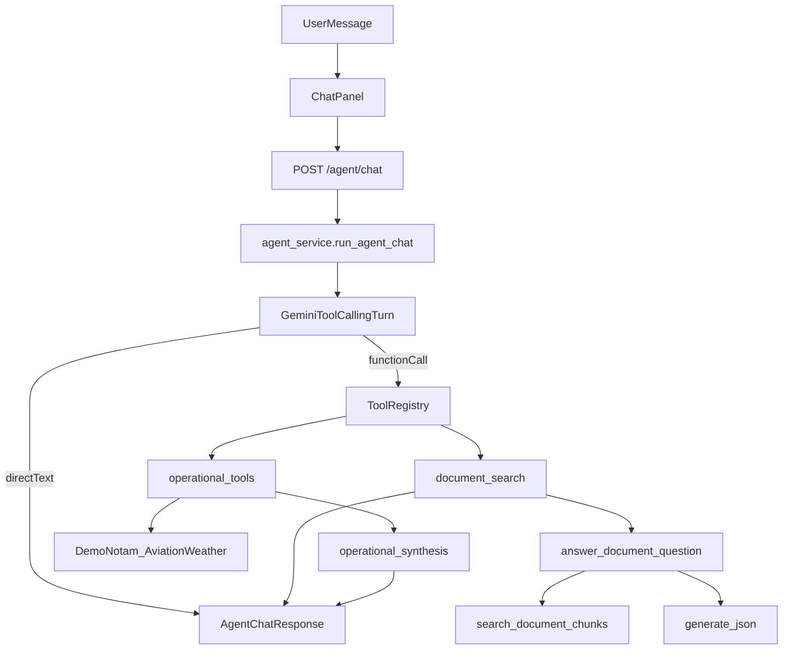

# Agent Architecture

## Overview

The Aviation Intelligence Platform is moving from a split-pane RAG console to a **single agent chat interface**. Users interact with one assistant that can answer directly or invoke typed tools. The first implemented tool is `document_search`, which wraps the existing cited RAG pipeline.

This design keeps the proven retrieval and citation validation path intact while preparing the backend for future aviation API tools and MCP adapters.

## Current Request Flow

## Layers

### 1. Chat API

- Endpoint: `POST /agent/chat`
- Request: `message`, optional `session_id`, optional `document_id`, optional `top_k`
- Response: `session_id`, `answer`, `citations`, `operational_sources`, `tool_activities`, `used_tools`, `direct_answer`, `insufficient_evidence`

Legacy endpoints remain available:

- `POST /rag/query`
- `POST /rag/search`

### 2. Agent Orchestrator

File: `apps/backend/app/services/agent_service.py`

Responsibilities:

- Build the agent system prompt
- Run a bounded Gemini tool-calling loop
- Validate and execute registered tools
- Return a unified response shape for the frontend

Current limits:

- Maximum tool rounds controlled by `AGENT_MAX_TOOL_ROUNDS`
- Recent-turn memory window controlled by `AGENT_MEMORY_MAX_TURNS`
- Sessions and messages persist in Postgres (`chat_sessions`, `chat_messages`)

### 3. Tool Registry

Files:

- `apps/backend/app/tools/base.py`
- `apps/backend/app/tools/registry.py`
- `apps/backend/app/tools/document_search.py`
- `apps/backend/app/tools/get_notams.py`
- `apps/backend/app/tools/get_metar.py`
- `apps/backend/app/tools/get_taf.py`
- `apps/backend/app/tools/get_international_sigmets.py`

Each tool exposes:

- `name`
- `description`
- JSON parameter schema
- `execute(arguments, context) -> ToolResult`

This contract is intentionally MCP-ready. Future external aviation tools can implement the same interface through an adapter without changing the chat API.

### 4. Document Search Tool

Tool name: `document_search`

Purpose:

- Search processed PDF chunks
- Generate a cited answer using the existing RAG pipeline
- Preserve server-side citation validation and insufficient-evidence behavior

Important rule:

- The agent must not fabricate document citations. Document evidence must come from this tool.

Implementation detail:

- The tool calls `answer_document_question(..., persist=False)` so agent turns do not duplicate audit rows in `rag_queries`.

### 5. Operational API Tools

Registered tools:

| Tool | Provider | Source type |
|------|----------|-------------|
| `get_notams` | Demo NOTAM provider (preloaded fixtures) | NOTAM |
| `get_metar` | AviationWeather.gov | METAR |
| `get_taf` | AviationWeather.gov | TAF |
| `get_international_sigmets` | AviationWeather.gov | SIGMET |

Shared infrastructure:

- `apps/backend/app/services/operational_http.py` — httpx client, safe error mapping
- `apps/backend/app/schemas/operational.py` — `OperationalRecord`, `OperationalSourceBundle`
- `apps/backend/app/services/operational_tools.py` — synthesis and routing helpers

Behavior:

- All external calls are server-side only
- Successful operational tool results get one bounded synthesis turn
- `operational_sources` are attached to the final `AgentChatResponse`
- Empty result sets are successful tool calls, not errors

Demo NOTAM provider notes:

- Source file: `apps/backend/app/data/demo_notams.json`
- Client: `apps/backend/app/services/demo_notam_client.py`
- Returns preloaded NOTAM records keyed by ICAO airport code
- Bundles are marked `is_live=False` with provider `demo-notam-api`
- Customize demo notices by editing the JSON fixture file

AviationWeather.gov notes:

- Public endpoints under `/api/data/metar`, `/api/data/taf`, `/api/data/isigmet`
- No API key required

### 6. Existing RAG Pipeline

The original RAG stack remains the source of truth for document answers:

1. `search_document_chunks`
2. similarity threshold filter
3. grounded prompt construction
4. `generate_json`
5. citation validation
6. insufficient-evidence downgrade

Files:

- `apps/backend/app/services/search_service.py`
- `apps/backend/app/services/rag_answer_service.py`
- `apps/backend/app/services/llm_service.py`

## Frontend Contract

The chat shell now calls `POST /agent/chat` instead of `POST /rag/query`.

Assistant messages may include:

- `toolActivities` — concise tool-use status
- `citations` — document evidence when `document_search` was used
- `operationalSources` — live provider metadata and compact operational records
- `directAnswer` — true when the agent answered without tools

Upload and document processing still use the document library workflow in this iteration.

## Trust Boundaries

| Capability | Source of truth |
|------------|-----------------|
| Document citations | `document_search` tool only |
| General aviation answers | Direct agent response |
| Live NOTAM / weather / SIGMET data | Operational API tools only |
| Source timestamps for live ops data | `retrieved_at` on `operational_sources` |
| Conversation history | `chat_sessions` / `chat_messages` + recent-turn agent context |

## Configuration

Relevant backend settings:

| Variable | Purpose |
|----------|---------|
| `AGENT_MAX_TOOL_ROUNDS` | Maximum tool loop iterations (default 3) |
| `AGENT_TEMPERATURE` | Agent turn temperature |
| `AGENT_MAX_OUTPUT_TOKENS` | Agent response token budget |
| `AVIATION_WEATHER_BASE_URL` | AviationWeather.gov API base URL |
| `OPERATIONAL_CACHE_TTL_SECONDS` | Optional operational response cache TTL |
| `RAG_*` | Retrieval and citation behavior for document tool |
| `LLM_*` | Shared Gemini model settings |

## Future MCP Adapter

Planned pattern:

1. Keep internal `AgentTool` contract
2. Add `McpToolAdapter` that maps MCP server tools into the same registry
3. Register additional aviation providers through the adapter without changing the chat API

The chat API and frontend should not need to change when new tools are added.

## Implemented vs Planned

### Implemented

- Unified agent chat endpoint
- Internal tool registry
- `document_search` tool
- Operational tools: `get_notams`, `get_metar`, `get_taf`, `get_international_sigmets`
- Tool activity and operational source display in chat UI
- Conversation memory with persistent chat sessions
- Legacy RAG endpoints preserved

### Planned

- MCP adapter layer
- Hybrid retrieval and reranking behind `document_search`
- Agent observability dashboard
- Evaluation pipeline for tool routing and answer quality
- End-user authentication and multi-tenant ownership
