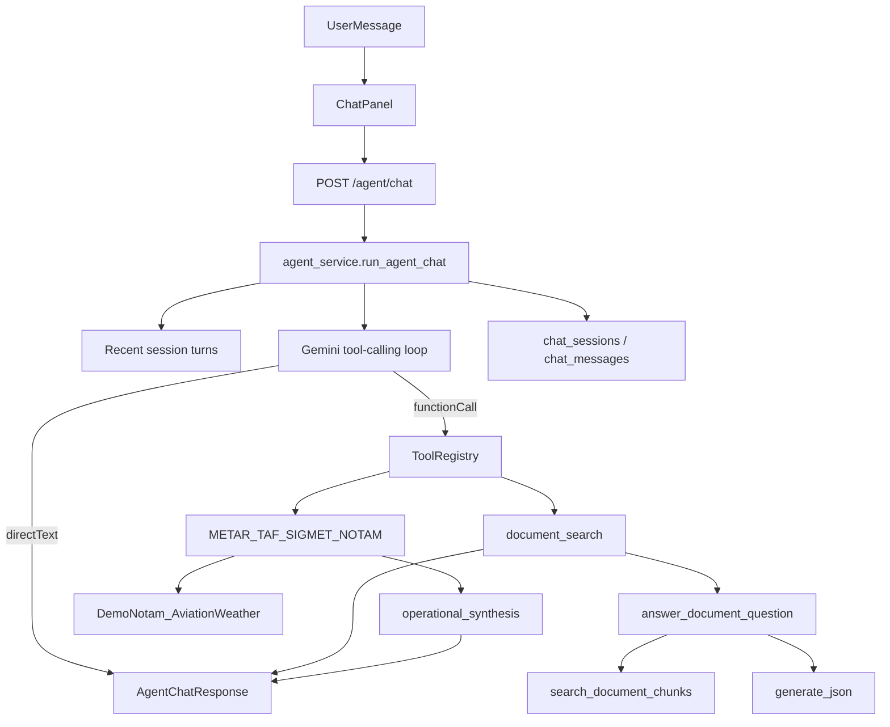

# Agent Architecture

## Overview

The Aviation Intelligence Platform uses a **single agent chat interface**. Users talk to one assistant that can answer directly or invoke typed tools for document evidence and live operational data.

Cited document answers still go through the original RAG pipeline (retrieval, grounded generation, citation validation). Operational answers come only from registered aviation tools. The tool contract is MCP-ready so new providers can be added without changing the chat API.

## Request flow

## Layers

### 1. Chat API

| Method | Path | Purpose |
|--------|------|---------|
| `POST` | `/agent/chat` | Run one agent turn |
| `POST` | `/agent/sessions` | Create a session |
| `GET` | `/agent/sessions` | List sessions |
| `GET` | `/agent/sessions/{id}` | Load session + messages |
| `DELETE` | `/agent/sessions/{id}` | Delete a session |

`POST /agent/chat` request fields:

- `message` (required)
- `session_id` (optional — creates a session when omitted)
- `document_id` (optional — scopes `document_search`)
- `top_k` (optional)

Response fields include: `session_id`, `answer`, `citations`, `operational_sources`, `tool_activities`, `used_tools`, `direct_answer`, `insufficient_evidence`, `used_chunk_count`.

Legacy endpoints remain available for compatibility and tests:

- `POST /rag/query`
- `POST /rag/search`

### 2. Agent orchestrator

File: `apps/backend/app/services/agent_service.py`

Responsibilities:

- Build the agent system prompt and tool declarations
- Load recent turns for session memory
- Run a bounded Gemini tool-calling loop
- Execute tools through the registry
- Force request `document_id` onto `document_search` args when the UI scopes a document
- Persist user/assistant messages and return a unified response

Limits (env-configurable):

| Setting | Role |
|---------|------|
| `AGENT_MAX_TOOL_ROUNDS` | Max tool loop iterations (default 3) |
| `AGENT_MEMORY_MAX_TURNS` | Recent turns injected into context |
| `AGENT_TEMPERATURE` / `AGENT_MAX_OUTPUT_TOKENS` | Generation budget |

### 3. Tool registry

Files:

- `apps/backend/app/tools/base.py`
- `apps/backend/app/tools/registry.py`
- `apps/backend/app/tools/document_search.py`
- `apps/backend/app/tools/get_notams.py`
- `apps/backend/app/tools/get_metar.py`
- `apps/backend/app/tools/get_taf.py`
- `apps/backend/app/tools/get_international_sigmets.py`

Each tool exposes:

- `name`
- `description`
- JSON parameter schema
- `execute(arguments, context) -> ToolResult`

### 4. `document_search`

Purpose:

- Search processed PDF chunks
- Generate a cited answer via the existing RAG pipeline
- Preserve server-side citation validation and insufficient-evidence behavior

Rules:

- The agent must not fabricate document citations
- When the HTTP request includes `document_id`, that value always overrides any model-supplied `document_id` in tool args
- The tool calls `answer_document_question(..., persist=False)` so agent turns do not duplicate `rag_queries` audit rows

### 5. Operational tools

| Tool | Provider | Source type | Live? |
|------|----------|-------------|-------|
| `get_notams` | Demo NOTAM fixtures | NOTAM | No (`is_live=False`) |
| `get_metar` | AviationWeather.gov | METAR | Yes |
| `get_taf` | AviationWeather.gov | TAF | Yes |
| `get_international_sigmets` | AviationWeather.gov | SIGMET | Yes |

Shared infrastructure:

- `apps/backend/app/services/operational_http.py` — httpx client, safe error mapping
- `apps/backend/app/schemas/operational.py` — `OperationalRecord`, `OperationalSourceBundle`
- `apps/backend/app/services/operational_tools.py` — synthesis helpers

Behavior:

- All external calls are server-side only
- URLs are built from a fixed base + validated station/ICAO codes (no arbitrary URL tools)
- Successful operational results get one bounded synthesis turn
- Empty result sets are successful tool calls, not errors
- Bundles attach `retrieved_at`, `provider`, and `source_url`

Demo NOTAMs:

- Data: `apps/backend/app/data/demo_notams.json`
- Client: `apps/backend/app/services/demo_notam_client.py`
- Customize by editing the JSON fixture

AviationWeather.gov:

- Public endpoints under `/api/data/metar`, `/api/data/taf`, `/api/data/isigmet`
- No API key required

### 6. RAG pipeline (document answers)

Source of truth for document Q&A:

1. `search_document_chunks`
2. Similarity threshold filter
3. Grounded prompt construction
4. `generate_json`
5. Citation validation
6. Insufficient-evidence downgrade

Key files:

- `apps/backend/app/services/search_service.py`
- `apps/backend/app/services/rag_answer_service.py`
- `apps/backend/app/services/llm_service.py`
- `apps/backend/app/services/embedding_service.py`

## Frontend contract

The workspace calls `POST /agent/chat` (not `/rag/query` for the main chat path).

Assistant messages may show:

- `toolActivities` — tool-use status
- `citations` — document evidence from `document_search`
- `operationalSources` — provider metadata and compact records
- `directAnswer` — true when no tools were used
- Markdown-rendered answers (`react-markdown` + GFM)

Users can scope chat to a processed document (including drag-and-drop attach). Upload and processing stay in the document library.

## Trust boundaries

| Capability | Source of truth |
|------------|-----------------|
| Document citations | `document_search` only |
| General aviation knowledge | Direct agent response |
| Live weather / SIGMETs | Operational API tools only |
| NOTAMs (demo) | `get_notams` fixture tool only |
| Ops source timestamps | `retrieved_at` on `operational_sources` |
| Conversation history | `chat_sessions` / `chat_messages` + recent-turn context |
| Document scope when attached | Request `document_id` wins over model tool args |

## Configuration

| Variable | Purpose |
|----------|---------|
| `AGENT_MAX_TOOL_ROUNDS` | Max tool loop iterations |
| `AGENT_MEMORY_MAX_TURNS` | Recent turns for memory |
| `AGENT_TEMPERATURE` | Agent turn temperature |
| `AGENT_MAX_OUTPUT_TOKENS` | Agent response token budget |
| `AVIATION_WEATHER_BASE_URL` | AviationWeather.gov base URL |
| `OPERATIONAL_CACHE_TTL_SECONDS` | Optional ops response cache TTL |
| `RAG_*` | Retrieval and citation behavior |
| `LLM_*` | Shared Gemini model / cache settings |
| `GEMINI_API_KEY` | Embeddings + agent + RAG generation |

## Future MCP adapter

Planned pattern:

1. Keep the internal `AgentTool` contract
2. Add an adapter that maps MCP server tools into the same registry
3. Register additional providers without changing `POST /agent/chat` or the frontend

## Status

### Implemented

- Unified agent chat + session APIs
- Typed tool registry
- `document_search` over citation-validated RAG
- Operational tools: NOTAMs (demo), METAR, TAF, international SIGMETs
- Multi-tool turns in one agent loop
- Conversation memory with persistent sessions
- UI: tool activity, citations, operational provenance, document scope, markdown answers
- Legacy `/rag/*` endpoints

### Possible next steps

- End-user authentication and multi-tenant ownership
- MCP adapter layer
- Hybrid retrieval and reranking behind `document_search`
- Observability / evaluation harness
- Live NOTAM provider (replace demo fixture)

See also: [`AVIATION_INTELLIGENCE_AI_PLATFORM.md`](AVIATION_INTELLIGENCE_AI_PLATFORM.md), [`../README.md`](../README.md)
